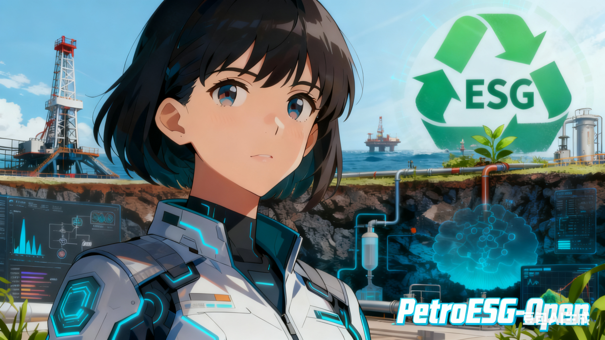

<picture>  <!-- 深色模式图片（相对路径） -->  <source media="(prefers-color-scheme: dark)" srcset="README.assets/banner-dark.png">  <!-- 浅色模式/默认图片（相对路径，作为 fallback） -->   </picture>

<h1 align="center"> Hi there, I'm 𝕃𝕦𝕔𝕚𝕒</h1>

A curious learner passionate about Petroleum Engineering, AI & ESG.

I am an undergraduate student @ [China University of Petroleum](https://www.cup.edu.cn/).

  

  

### 💫 Tech Stack and Tools

| Domain           | Skills                                                       |
| :--------------- | :----------------------------------------------------------- |
| Design           |    |
| SoftDev          |     |
| Machine Learning |   |
| IDE              |     |
| OS               |   |
| Other            |  |

### ⭐️ Blogs & Contributions

You can checkout my blog [here](https://6ucia.github.io/).

> [!NOTE]
> Feel free to explore my articles and projects, and connect with me on GitHub!

### 📝 Notes

Here are some notes I took while pursuing my degree at China University of Petroleum / College of Petroleum Engineering, hoping they can help those who come after me.

-   [Python_MachineLearning_Experiments](https://github.com/6uxijia/Python_MachineLearning_Experiments)
-   [知识共享](https://github.com/6uxijia/Knowledge_share)
-   [石油工程AI应用](https://github.com/6uxijia/Petroleum_Engineering_AI)
-   [石油工程ESG](https://github.com/6uxijia/Petroleum_Engineering_ESG)

### 👀 My GitHub Stats

   
  

Hit me up anytime and let's explore new ideas together! 😺✨
